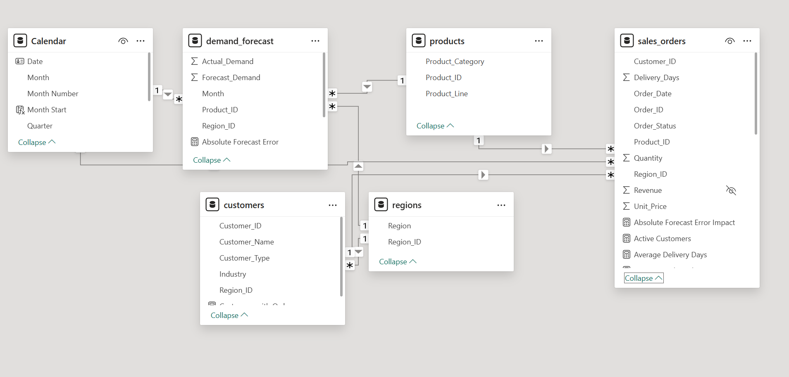

# Demand Forecasting & Sales Operations Analytics

## Project Overview

This project analyzes sales performance, customer behavior, and demand forecasting accuracy using Power BI.

## Business Problem

Sales operations teams need a reliable way to monitor revenue performance, understand customer and product trends, and evaluate whether demand forecasts accurately reflect actual business demand.

Without an integrated analytics view, it can be difficult to identify revenue trends, customer concentration, regional performance differences, and forecast exceptions that may affect operational planning.

This project develops a Power BI analytics solution that integrates sales, customer, product, regional, and demand forecasting data into a unified decision-support dashboard.

## Business Questions

This analysis focuses on four key business questions:

1. **Overall Performance:** How are revenue, order volume, and active customers performing over time and across regions and product lines?

2. **Customer & Sales Analysis:** Which customers, segments, regions, and products contribute most to sales performance?

3. **Demand Forecasting:** How closely does forecast demand match actual demand, and where are the largest forecast errors or biases?

4. **Operational Exceptions:** Which products, regions, or periods require attention due to significant demand or forecast deviations?

## Dashboard Preview

### 1. Executive Overview


### 2. Sales & Customer Intelligence


### 3. Demand Forecasting Analytics


### 4. Operational Performance


## Key Insights

- **Sales generated $2.68B in total revenue across 10K orders and 50 active customers**, with an average order value of approximately **$268.1K**.

- **Revenue was concentrated in Distributor and OEM customers**, which generated approximately **$1.33B and $913.2M**, respectively. The top 10 customers accounted for only **22.53% of total revenue**, suggesting relatively low dependence on individual customers.

- **South America was the largest regional market**, generating approximately **$1.03B in revenue**, followed by Europe at **$695.35M**. Asia generated the lowest regional revenue at approximately **$412.56M**.

- **Demand forecasting performance was strong overall**, with **94.94% forecast accuracy** and **5.06% WAPE**. Total forecast demand of **10.36M** was also close to actual demand of **10.34M**.

- **Forecast accuracy varied across product categories and regions despite strong aggregate performance.** Sensor achieved the highest overall category accuracy at **95.51%**, while Control Unit recorded the lowest at **94.47%**. The weakest category-region combination was **Control Unit in South America at 93.78%**, highlighting an area for targeted forecast improvement.

- **Operational execution achieved an 89.05% on-time order rate**, with approximately **8.91K of 10K orders delivered on time**. North America recorded the strongest regional on-time performance at **89.62%**, while Asia was lowest at **87.94%**. Control Unit had the highest delayed-order rate among product categories at **12.43%**, indicating a potential operational bottleneck.

## Data Model

The Power BI semantic model uses a dimensional modeling approach with two primary fact tables: `sales_orders` for transactional sales and operational analysis, and `demand_forecast` for demand forecasting analysis.

Shared dimension tables provide consistent filtering across the analytical model:

### Fact Tables

- **sales_orders** — Order-level transactions used for revenue, customer, and delivery-performance analysis.
- **demand_forecast** — Actual and forecast demand used for forecast accuracy and error analysis.

### Dimension Tables

- **Calendar** — Date dimension supporting monthly and quarterly analysis.
- **customers** — Customer attributes and segmentation.
- **products** — Product category and product line attributes.
- **regions** — Geographic region attributes.



## Data Source

This project uses synthetic datasets created for portfolio demonstration purposes. The data simulates sales transactions, customer information, product categories, regional operations, and demand forecasts.

The datasets do not represent actual business performance or contain real customer information.

All five source CSV files are available in the `data/` directory. The Power BI report is available in the `powerbi/` directory.

## Key DAX Measures

The dashboard uses reusable DAX measures to evaluate sales performance, customer activity, operational efficiency, and demand forecasting accuracy. Selected measures are shown below.

### Forecast Accuracy

```DAX
Forecast Accuracy = 
1 - [WAPE %]
```

Measures overall forecasting performance, where a higher value indicates closer alignment between forecast and actual demand.

### WAPE

```DAX
WAPE % = 
DIVIDE(
    [Absolute Forecast Error],
    SUM(demand_forecast[Actual_Demand])
)
```

Calculates Weighted Absolute Percentage Error (WAPE) to measure total forecast error relative to actual demand.

### Forecast Bias

```DAX
Forecast Bias % =
DIVIDE(
    [Total Forecast Demand] - [Total Actual Demand],
    [Total Actual Demand]
)
```

Identifies systematic over-forecasting or under-forecasting. Positive values indicate over-forecasting, while negative values indicate under-forecasting.

### Total Revenue

```DAX
Total Revenue = 
SUM(sales_orders[Revenue])
```

Calculates total sales revenue within the current filter context.

### Revenue YoY Growth

```DAX
Revenue YoY Growth % = 
DIVIDE(
    [Total Revenue] - [Revenue Previous Year],
    [Revenue Previous Year]
)
```

Measures year-over-year revenue growth to evaluate changes in sales performance over time.

### Active Customers

```DAX
Active Customers =
DISTINCTCOUNT(sales_orders[Customer_ID])
```

Counts distinct customers with order activity within the current filter context.

## Tools & Technologies

- **Power BI Desktop** — Data modeling, DAX development, dashboard design, and interactive reporting
- **DAX** — KPI calculations, time intelligence, forecasting metrics, and operational performance measures
- **Power Query** — Data transformation and preparation
- **SQL** — Data querying and analytical preparation
- **Excel / CSV** — Source data preparation and validation
- **Git & GitHub** — Version control and project documentation

## Repository Structure

```text
demand-forecasting-sales-analytics/
│
├── images/
│   ├── 01-executive-overview.png
│   ├── 02-sales-customer-intelligence.png
│   ├── 03-demand-forecasting-analytics.png
│   ├── 04-operational-performance.png
│   └── data-model.png
│
└── README.md