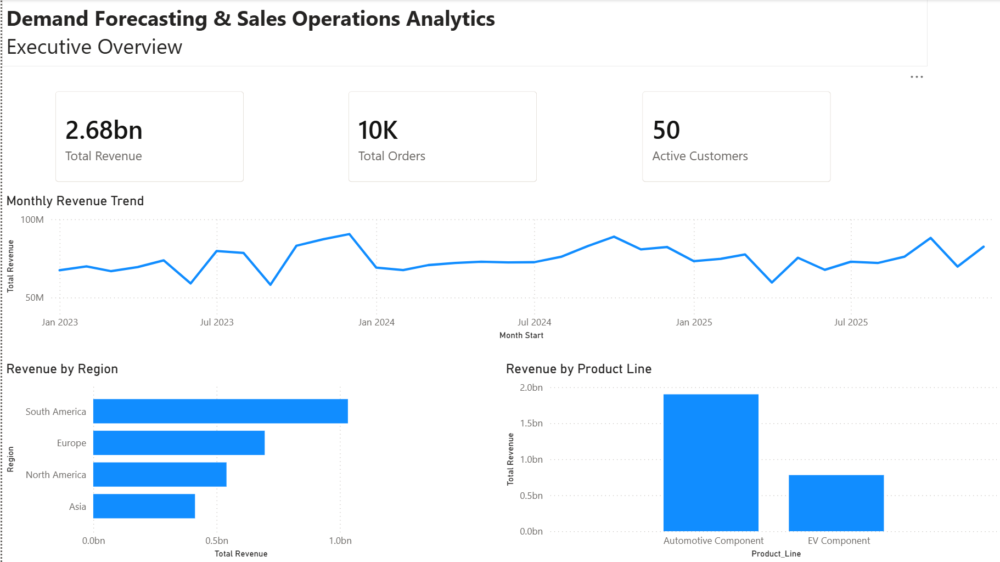
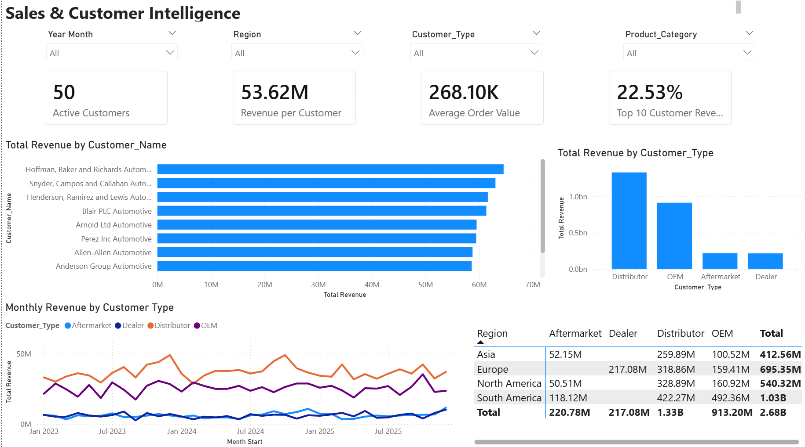
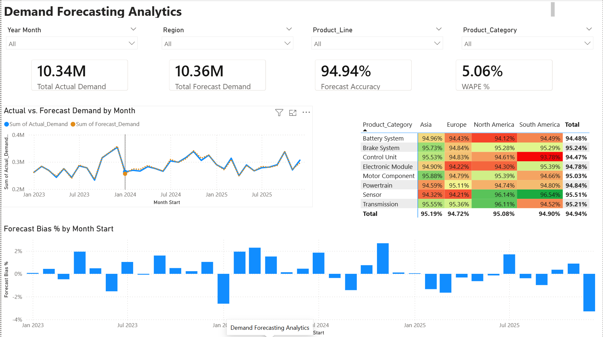
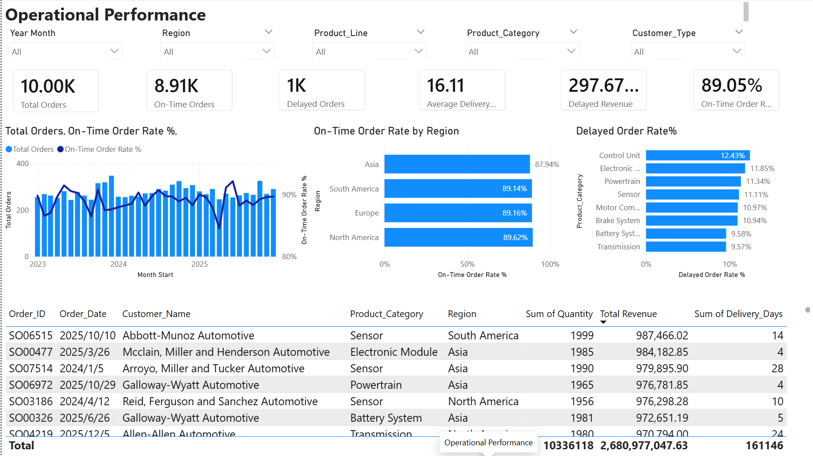

# Demand Forecasting & Sales Operations Analytics

## Project Overview

This project analyzes sales performance, customer behavior, and demand forecasting accuracy using Power BI.

## Business Problem

Sales operations teams need a reliable way to monitor revenue performance, understand customer and product trends, and evaluate whether demand forecasts accurately reflect actual business demand.

Without an integrated analytics view, it can be difficult to identify revenue trends, customer concentration, regional performance differences, and forecast exceptions that may affect operational planning.

This project develops a Power BI analytics solution that integrates sales, customer, product, regional, and demand forecasting data into a unified decision-support dashboard.

## Business Questions

This analysis focuses on four key business questions:

1. **Overall Performance:** How are revenue, order volume, and active customers performing over time and across regions and product lines?

2. **Customer & Sales Analysis:** Which customers, segments, regions, and products contribute most to sales performance?

3. **Demand Forecasting:** How closely does forecast demand match actual demand, and where are the largest forecast errors or biases?

4. **Operational Exceptions:** Which products, regions, or periods require attention due to significant demand or forecast deviations?

## Tools

- Power BI
- DAX
- SQL
- Excel

## Dashboard Preview

### 1. Executive Overview

### 2. Sales & Customer Intelligence

### 3. Demand Forecasting Analytics

### 4. Operational Performance

## Key Insights

- **Sales generated $2.68B in total revenue across 10K orders and 50 active customers**, with an average order value of approximately **$268.1K**.

- **Revenue was concentrated in Distributor and OEM customers**, which generated approximately **$1.33B and $913.2M**, respectively. The top 10 customers accounted for only **22.53% of total revenue**, suggesting relatively low dependence on individual customers.

- **South America was the largest regional market**, generating approximately **$1.03B in revenue**, followed by Europe at **$695.35M**. Asia generated the lowest regional revenue at approximately **$412.56M**.

- **Demand forecasting performance was strong overall**, with **94.94% forecast accuracy** and **5.06% WAPE**. Total forecast demand of **10.36M** was also close to actual demand of **10.34M**.

- **Forecast accuracy varied across product categories and regions despite strong aggregate performance.** Sensor achieved the highest overall category accuracy at **95.51%**, while Control Unit recorded the lowest at **94.47%**. The weakest category-region combination was **Control Unit in South America at 93.78%**, highlighting an area for targeted forecast improvement.

- **Operational execution achieved an 89.05% on-time order rate**, with approximately **8.91K of 10K orders delivered on time**. North America recorded the strongest regional on-time performance at **89.62%**, while Asia was lowest at **87.94%**. Control Unit had the highest delayed-order rate among product categories at **12.43%**, indicating a potential operational bottleneck.
